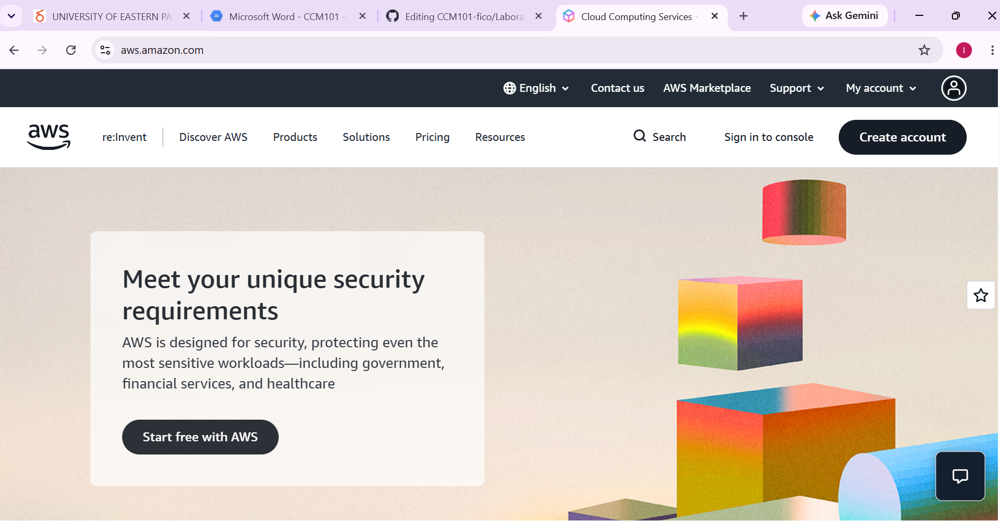

# AWS Research

Amazon Web Services (AWS) is a public cloud computing platform provided by Amazon. AWS offers a large collection of cloud services that organizations can use to build, deploy, manage, and scale applications.
AWS provides services for computing, storage, networking, databases, security, artificial intelligence, analytics, containers, and application development. AWS is widely used by startups, enterprises, government organizations, educational institutions, and technology companies.

## Global Infrastructure

AWS operates a global cloud infrastructure organized into geographic Regions and Availability Zones.
An AWS Region represents a separate geographic area. Within Regions are Availability Zones, which are isolated locations designed to support highly available applications.

Organizations can select cloud Regions based on factors such as:

- Geographic location
- Network latency
- Regulatory requirements
- Data residency
- Availability requirements
- Service availability

AWS also provides infrastructure such as Local Zones and other edge infrastructure for workloads that require lower latency.
AWS documentation explains that each AWS Region has multiple Availability Zones to support highly available application architectures.

## Cloud Management Console

The AWS Management Console is a web-based interface used to access and manage AWS services.

Through the console, users can:

- Create virtual machines.
- Configure storage.
- Manage networks.
- Create databases.
- Configure security and permissions.
- Monitor cloud resources.
- Manage billing and costs.

The console provides a centralized interface for managing AWS resources.

## Four Core AWS Services

### 1. Amazon EC2

Amazon Elastic Compute Cloud (EC2) provides resizable computing capacity in the AWS cloud.
EC2 allows organizations to create and run virtual machines with different CPU, memory, storage, and networking configurations.

Common uses include:

- Web servers
- Application servers
- Development environments
- Enterprise applications
- Linux servers

---

### 2. Amazon S3

Amazon Simple Storage Service (S3) is an object storage service.

S3 can be used to store:

- Images
- Videos
- Documents
- Backups
- Application files
- Data archives

S3 is designed for scalable and durable object storage.

---

### 3. Amazon VPC

Amazon Virtual Private Cloud (VPC) allows users to create logically isolated networks within AWS.

VPC can be used to configure:

- Subnets
- IP addresses
- Routing
- Internet gateways
- Security groups
- Network access controls

---

### 4. AWS IAM

AWS Identity and Access Management (IAM) controls access to AWS resources.

IAM can be used to manage:

- Users
- Groups
- Roles
- Policies
- Permissions

IAM helps organizations control which users and applications can access cloud resources.

---

## Three Advantages of AWS

### 1. Broad Service Portfolio

AWS provides a very large collection of services covering computing, storage, databases, networking, analytics, AI, security, containers, and many other areas.

### 2. Global Infrastructure

AWS provides infrastructure across many geographic Regions and Availability Zones, allowing organizations to deploy applications closer to their customers.

### 3. Scalability

AWS services can scale resources according to application requirements. Organizations can increase or decrease computing resources as demand changes.

---

## Typical Enterprise Use Cases

AWS can be used for:

- Web applications
- Mobile application backends
- Enterprise applications
- Data storage and backup
- Disaster recovery
- Artificial intelligence
- Machine learning
- Big data analytics
- Internet of Things applications
- Containerized applications
- Global e-commerce platforms

---

## AWS Screenshot

---

## Official References

- AWS Documentation: https://docs.aws.amazon.com/
- AWS Global Infrastructure: https://aws.amazon.com/about-aws/global-infrastructure/
- Amazon EC2: https://aws.amazon.com/ec2/
- Amazon S3: https://aws.amazon.com/s3/
- Amazon VPC: https://aws.amazon.com/vpc/
- AWS IAM: https://aws.amazon.com/iam/
