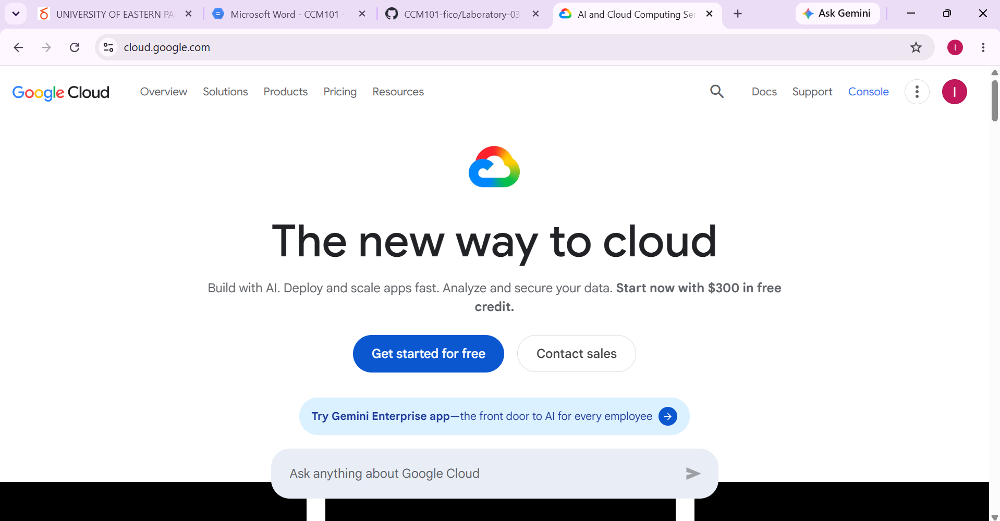

# Google Cloud Platform

Google Cloud Platform (GCP), commonly called Google Cloud, is a public cloud computing platform provided by Google.
Google Cloud provides services for computing, storage, networking, databases, artificial intelligence, machine learning, analytics, containers, security, and application development.
Google Cloud is particularly strong in areas such as artificial intelligence, machine learning, data analytics, Kubernetes, and cloud-native application development.

## Global Infrastructure

Google Cloud operates a global infrastructure consisting of Regions and Zones.
A Region represents a geographic location, while Zones are isolated deployment areas within Regions.
Google Cloud's global infrastructure allows organizations to deploy applications across different geographic locations.

Google Cloud provides infrastructure across multiple continents and supports workloads requiring:

- High availability
- Low latency
- Global scalability
- Disaster recovery
- Data residency
- AI and machine learning performance

## Cloud Management Console

The Google Cloud Console is a web-based management interface for Google Cloud resources.

The console allows users to:

- Create virtual machines.
- Manage storage.
- Configure networks.
- Deploy applications.
- Manage Kubernetes clusters.
- Configure identity and permissions.
- Monitor resources.
- Manage billing.

## Four Core Google Cloud Services

### 1. Compute Engine

Compute Engine provides virtual machines running on Google's infrastructure.

Compute Engine can be used for:

- Linux servers
- Windows servers
- Web applications
- Enterprise applications
- Development environments
- High-performance workloads

---

### 2. Cloud Storage

Cloud Storage is Google's object storage service.

It can be used to store:

- Images
- Videos
- Documents
- Backups
- Application data
- Large datasets

Cloud Storage provides scalable object storage for cloud applications.

---

### 3. Cloud IAM

Google Cloud Identity and Access Management allows organizations to control access to Google Cloud resources.

IAM can be used to manage:

- Users
- Service accounts
- Roles
- Permissions
- Policies

---

### 4. Google Kubernetes Engine

Google Kubernetes Engine (GKE) is a managed Kubernetes service.

It allows organizations to deploy and manage containerized applications using Kubernetes.

GKE is useful for:

- Microservices
- Containerized applications
- Cloud-native systems
- Automated application deployment
- Scalable applications

---

## Three Advantages of Google Cloud

### 1. Artificial Intelligence and Machine Learning

Google Cloud provides strong infrastructure and services for AI and machine learning workloads.

### 2. Kubernetes and Containers

Google Cloud provides Google Kubernetes Engine, a managed Kubernetes service that is deeply integrated with Google's cloud infrastructure.

### 3. Data Analytics

Google Cloud provides services for large-scale data processing and analytics, making it suitable for organizations working with large datasets.

---

## Typical Enterprise Use Cases

Google Cloud can be used for:

- Artificial intelligence
- Machine learning
- Data analytics
- Kubernetes applications
- Web applications
- Mobile application backends
- Big data processing
- Microservices
- Global applications
- Cloud-native development

---

## Google Cloud Screenshot

---

## Official References

- Google Cloud Documentation: https://cloud.google.com/docs
- Google Cloud Locations: https://cloud.google.com/about/locations/
- Compute Engine: https://cloud.google.com/products/compute
- Cloud Storage: https://cloud.google.com/storage
- Cloud IAM: https://cloud.google.com/iam
- Google Kubernetes Engine: https://cloud.google.com/kubernetes-engine
